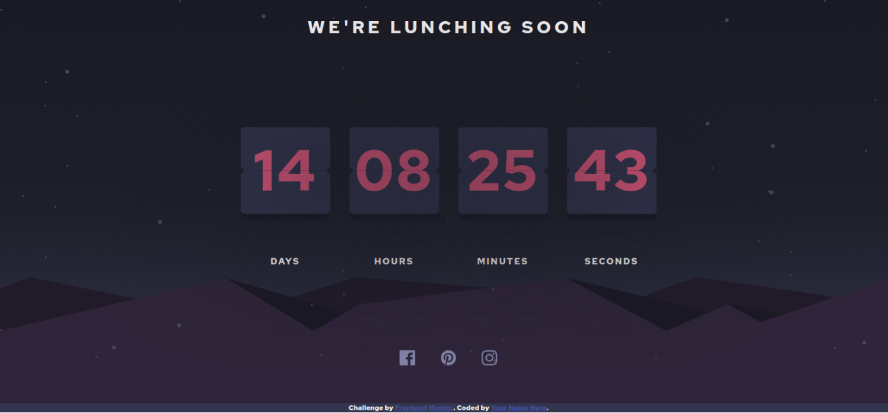
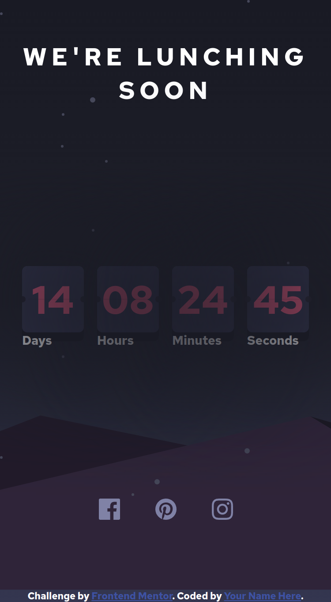

# Frontend Mentor - Sunnyside agency landing page solution

This is a solution to the [Launch Countdown Timer page challenge on Frontend Mentor](https://www.frontendmentor.io/challenges/launch-countdown-timer-N0XkGfyz-). Frontend Mentor challenges help you improve your coding skills by building realistic projects.

## Table of contents

- [Overview](#overview)
  - [The challenge](#the-challenge)
- [My process](#my-process)
  - [Built with](#built-with)
  - [Screenshot](#screenshot)
  - [What I learned](#what-i-learned)
- [Author](#author)
- [Acknowledgments](#acknowledgments)

## Overview

### The challenge

Users should be able to:

- View the optimal layout for the site depending on their device's screen size
- See hover states for all interactive elements on the page

### Links

- Solution URL: [GitHub](https://github.com/bipurna/launch-countdown-timer.git)
- Live Site URL: [GitHub Host](https://bipurna.github.com/launch-countdown-timer)

## My process

### Built with

- Semantic HTML5 markup
- CSS custom properties
- Flexbox
- [React](https://reactjs.org/) - JS library
### Screenshot

## Author

- Website - [Tara Kumar Sunuwar](https://www.tarakumarsunuwar.com.np)
- Frontend Mentor - [@bipurna](https://www.frontendmentor.io/profile/bipurna)
- Twitter - [@bipurna_](https://www.twitter.com/bipurna_)

## Acknowledgments

[Stack overflow](https://www.stackoverflow.com)
